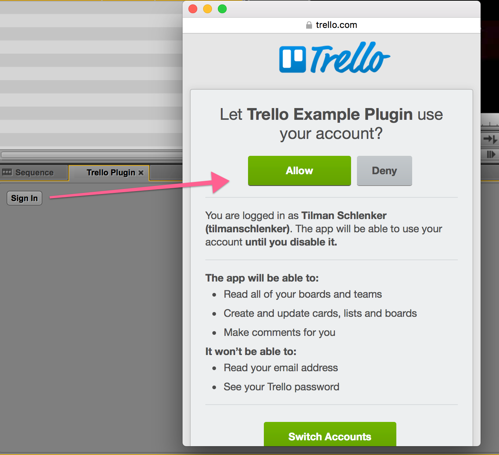
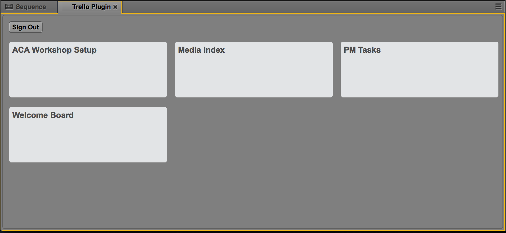
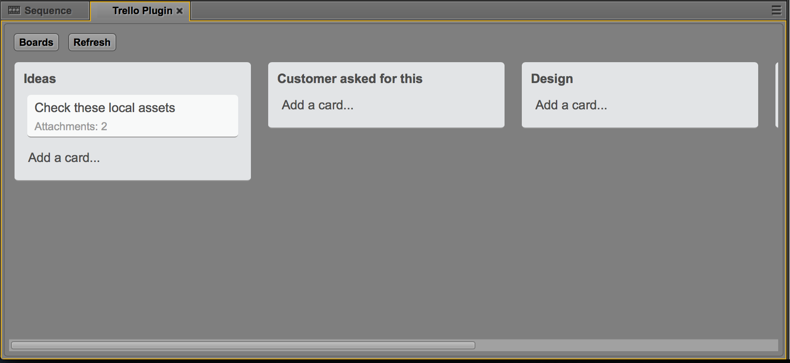
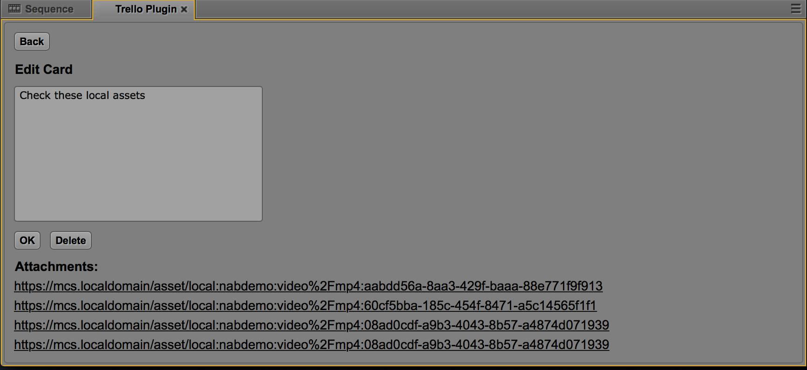
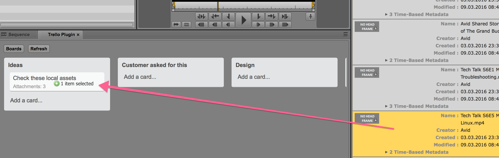
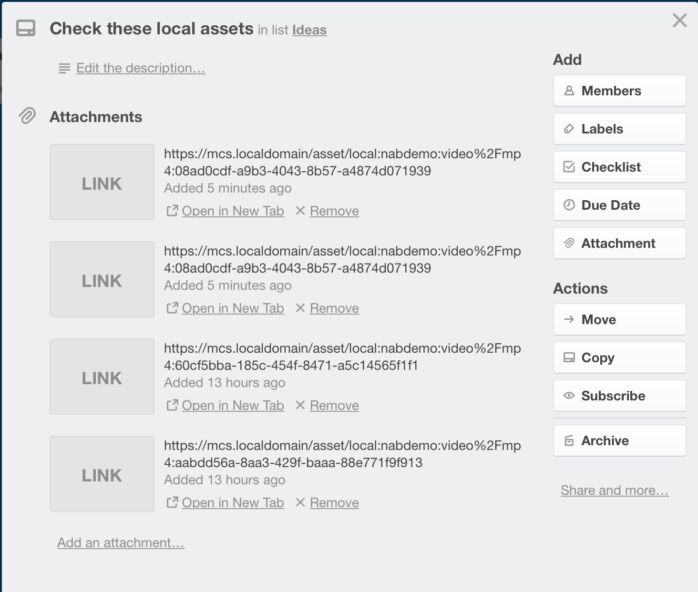

# Trello Plugin

## Introduction
The Trello plugin is a simple integration example that shows how an external service can be integrated in MCUX. The plugin itself uses the new static UI API which allows for integration of modern javascript libraries and styling into MediaCentral. 

In this case the UI is built using React and styling provided by Avid.

## Opening the Pane and logging in
When opening the pane for the first time the user needs to log in. This is done by pressing the Sign In button and then confirming the login using the OAuth window of the Trello service.

## Browsing cards
Once logged in the pane will show all boards of the user. This is a simplified implementation of Trello which allows for browsing, creating cards and editing them. It does not support more advanced Trello functions such as moving cards. 

In the board view all cards are shown with title and the number of attachments. Clicking on a card will open it to show details and allow editing of the card text.

## Attaching assets
The main feature of the integration is attachment of MediaCentral assets. Any asset that is draggable in MCUX can be dropped on a card and will be attached. Attached assets can be viewed in the card details and clicking on the attachment link will open this asset in MCUX.

## Links in Trello
The links in the Trello cards are stored as deep links. This makes it possible to view them in the Trello UI and the user can click on them to open MCUX with the correct asset loaded.

# Prerequisites
Download the UI Toolkit and put the node modules into a subdirectory called "modules". Your directory structure should look like this:

    - trello-plugin-example
        - docs
        - modules
            - avid-mcux
            - avid-mcux-actions-binder
            ...
        - src
        - test
        ...

# How to run using the avid-mcux proxy

Run in the project root:

    npm install && npm run build

Start proxy:

    ./node_modules/.bin/avid-mcux dev -b https://<your MediaCentral server>

Media Central with trello-plugin should be available at 'https://localhost:8090'.

# Building
* Build: `webpack`
* copy `package.json` and `dist` to the server

This should give you the following on the server

    - /opt/avid/share/nginx/plugins
        ... 
        - trello-plugin-example
            - package.json
            - dist
                - bundle.js
        ...
        

# Deploying to a MediaCentral | UX server

To deploy this example project to a production MediaCentral | UX server, build it by running
`npm install && npm run build`, and then copy the `trello-plugin-example` folder from `dist` to the following path
on the MediaCentral | UX server:

For Media Central | UX 2.8 and newer:

    /opt/avid/share/nginx/plugins

For Media Central | UX 2.6 and 2.7:

    /opt/avid/share/avid/media-central/htdocs/plugins
