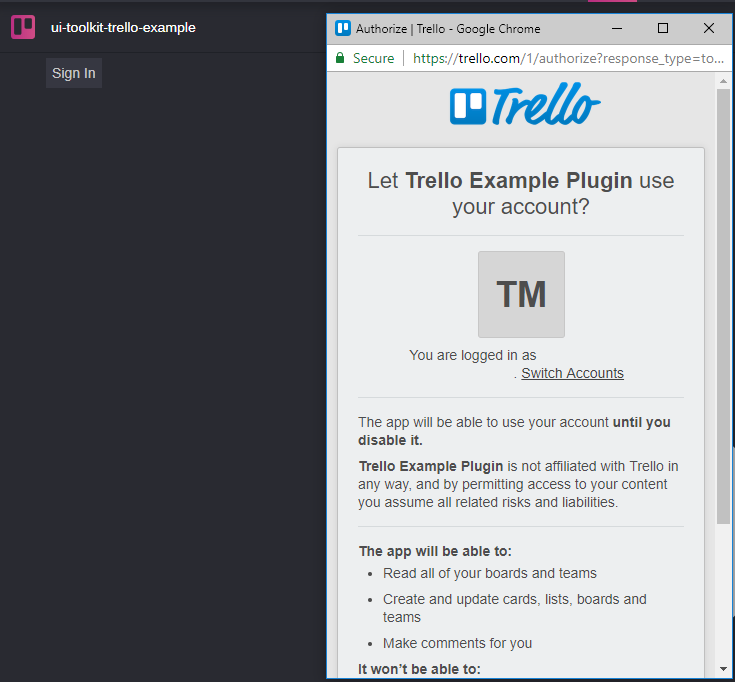
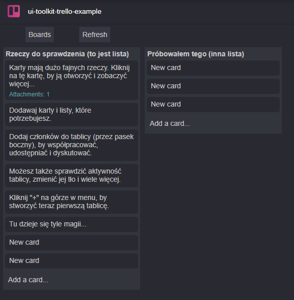

# Trello Plugin

## Introduction
The Trello plugin is a simple integration example that shows how an external service can be integrated in MediaCentral Cloud UX.

In this case the UI is built using React and styling provided by Avid.

## Opening the Pane and logging in
When opening the pane for the first time the user needs to log in. This is done by pressing the Sign In button and then confirming the login using the OAuth window of the Trello service.

## Browsing cards
Once logged in the pane will show all boards of the user. This is a simplified implementation of Trello which allows for browsing, creating cards and editing them. It does not support more advanced Trello functions such as moving cards. 

In the board view all cards are shown with title and the number of attachments. Clicking on a card will open it to show details and allow editing of the card text.

## How to run

Run in the project root:

    npm install
    npm run build
    npm start

## WARNING
To run these examples you will need a running MediaCentral Cloud UX server running. Connection settings can be changed in [src/package.json](src/package.json)
